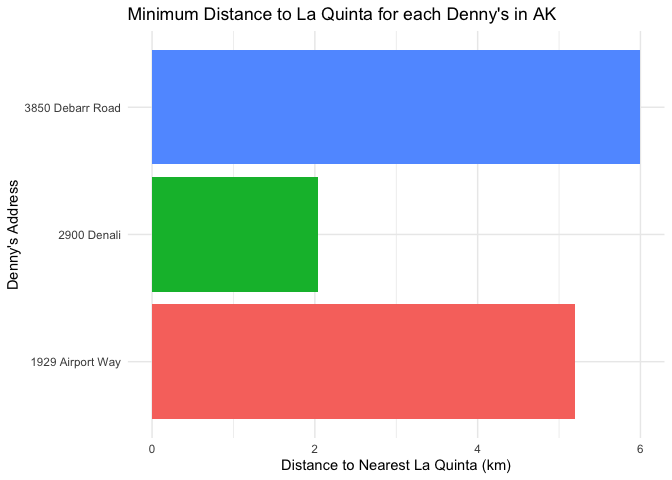

Lab 05 - La Quinta is Spanish for next to Denny’s, Pt. 2
================
Barbara Mu
02/09/2026

### Load packages and data

``` r
library(tidyverse) 
library(dsbox) 
```

``` r
states <- read_csv("data/states.csv")
```

``` r
dn <- dennys
lq <- laquinta
```

### Exercise 1

``` r
dn_ak <- dn %>%
  filter(state == "AK")
nrow(dn_ak)
```

    ## [1] 3

``` r
lq_ak <- lq %>%
  filter(state == "AK")
nrow(lq_ak)
```

    ## [1] 2

### Exercise 2

``` r
m <- nrow(dn_ak)
n <- nrow(lq_ak)
n_pairing <- m*n
```

There are 6 possible pairs we can calculate their distance.

### Exercise 3

``` r
dn_lq_ak <- full_join(dn_ak, lq_ak,
  by = "state"
)
```

    ## Warning in full_join(dn_ak, lq_ak, by = "state"): Detected an unexpected many-to-many relationship between `x` and `y`.
    ## ℹ Row 1 of `x` matches multiple rows in `y`.
    ## ℹ Row 1 of `y` matches multiple rows in `x`.
    ## ℹ If a many-to-many relationship is expected, set `relationship =
    ##   "many-to-many"` to silence this warning.

``` r
dn_lq_ak
```

    ## # A tibble: 6 × 11
    ##   address.x     city.x state zip.x longitude.x latitude.x address.y city.y zip.y
    ##   <chr>         <chr>  <chr> <chr>       <dbl>      <dbl> <chr>     <chr>  <chr>
    ## 1 2900 Denali   Ancho… AK    99503       -150.       61.2 3501 Min… "\nAn… 99503
    ## 2 2900 Denali   Ancho… AK    99503       -150.       61.2 4920 Dal… "\nFa… 99709
    ## 3 3850 Debarr … Ancho… AK    99508       -150.       61.2 3501 Min… "\nAn… 99503
    ## 4 3850 Debarr … Ancho… AK    99508       -150.       61.2 4920 Dal… "\nFa… 99709
    ## 5 1929 Airport… Fairb… AK    99701       -148.       64.8 3501 Min… "\nAn… 99503
    ## 6 1929 Airport… Fairb… AK    99701       -148.       64.8 4920 Dal… "\nFa… 99709
    ## # ℹ 2 more variables: longitude.y <dbl>, latitude.y <dbl>

### Exercise 4

The combined data frame contains 6 observations as we joined them by
`state`.

### Exercise 5

``` r
haversine <- function(long1, lat1, long2, lat2, round = 3) {
  # convert to radians
  long1 <- long1 * pi / 180
  lat1 <- lat1 * pi / 180
  long2 <- long2 * pi / 180
  lat2 <- lat2 * pi / 180

  R <- 6371 # Earth mean radius in km

  a <- sin((lat2 - lat1) / 2)^2 + cos(lat1) * cos(lat2) * sin((long2 - long1) / 2)^2
  d <- R * 2 * asin(sqrt(a))

  return(round(d, round)) # distance in km
}
```

The function we should use is mutate(), as we need to create new
variable

### Exercise 6

``` r
dn_lq_ak <- dn_lq_ak %>%
  mutate(distance = haversine(longitude.x, latitude.x, longitude.y, latitude.y))
```

### Exercise 7

``` r
dn_lq_ak_mindist <- dn_lq_ak %>%
  group_by(address.x) %>%
  summarize(closest = min(distance))
```

### Exercise 8

``` r
library(ggplot2)

ggplot(dn_lq_ak_mindist, aes(x = address.x, y = closest, fill = address.x)) +
  geom_col() +
  coord_flip() +  
  labs(
    title = "Minimum Distance to La Quinta for each Denny's in AK",
    x = "Denny's Address",
    y = "Distance to Nearest La Quinta (km)"
  ) +
  theme_minimal() +
  guides(fill = "none") 
```

<!-- -->

### Exercise 9

``` r
dn_nc <- dn %>% filter(state == "NC")
lq_nc <- lq %>% filter(state == "NC")
dn_lq_nc <- full_join(dn_nc, lq_nc, by = "state")
```

    ## Warning in full_join(dn_nc, lq_nc, by = "state"): Detected an unexpected many-to-many relationship between `x` and `y`.
    ## ℹ Row 1 of `x` matches multiple rows in `y`.
    ## ℹ Row 1 of `y` matches multiple rows in `x`.
    ## ℹ If a many-to-many relationship is expected, set `relationship =
    ##   "many-to-many"` to silence this warning.

``` r
dn_lq_nc <- dn_lq_nc %>%
  mutate(distance = haversine(longitude.x, latitude.x, longitude.y, latitude.y))

dn_lq_nc_mindist <- dn_lq_nc %>%
  group_by(address.x) %>%
  summarize(closest = min(distance))
```

### Exercise 10

``` r
dn_tx <- dn %>% filter(state == "TX")
lq_tx <- lq %>% filter(state == "TX")
dn_lq_tx <- full_join(dn_tx, lq_tx, by = "state")
```

    ## Warning in full_join(dn_tx, lq_tx, by = "state"): Detected an unexpected many-to-many relationship between `x` and `y`.
    ## ℹ Row 1 of `x` matches multiple rows in `y`.
    ## ℹ Row 1 of `y` matches multiple rows in `x`.
    ## ℹ If a many-to-many relationship is expected, set `relationship =
    ##   "many-to-many"` to silence this warning.

``` r
dn_lq_tx <- dn_lq_tx %>%
  mutate(distance = haversine(longitude.x, latitude.x, longitude.y, latitude.y))

dn_lq_tx_mindist <- dn_lq_tx %>%
  group_by(address.x) %>%
  summarize(closest = min(distance))
```

### Exercise 11

``` r
dn_ny <- dn %>% filter(state == "NY")
lq_ny <- lq %>% filter(state == "NY")
dn_lq_ny <- full_join(dn_ny, lq_ny, by = "state")
```

    ## Warning in full_join(dn_ny, lq_ny, by = "state"): Detected an unexpected many-to-many relationship between `x` and `y`.
    ## ℹ Row 1 of `x` matches multiple rows in `y`.
    ## ℹ Row 1 of `y` matches multiple rows in `x`.
    ## ℹ If a many-to-many relationship is expected, set `relationship =
    ##   "many-to-many"` to silence this warning.

``` r
dn_lq_ny <- dn_lq_ny %>%
  mutate(distance = haversine(longitude.x, latitude.x, longitude.y, latitude.y))

dn_lq_ny_mindist <- dn_lq_ny %>%
  group_by(address.x) %>%
  summarize(closest = min(distance))
```

### Exercise 12

Mitch Hedberg’s joke is most likely to be true in Texas. By checking the
distance datasets we created in the last four exercises, I found the
smallest ‘closet’ value is from Texas (the address is 607 Avenue Q, and
the distance between the Denny and La Quinta is 0.016)
